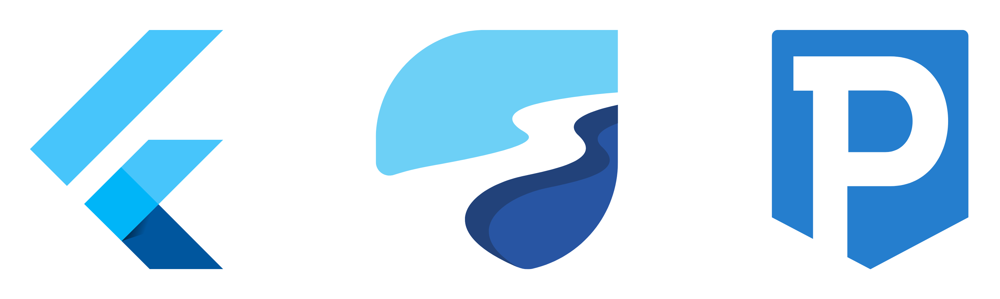

<h1 align="center">
    Features 🔥
</h1>

* Retrieve events from backend using REST APIs and displays them.
* Filter events according to their category.
* Purchase tickets using the PayTabs payment gateway.
* Search & view events on a google maps display.

<h1 align="center">
    Demo 💾 (The gifs may take time to load...)
</h1>
<p float="left" align="center">


</p>

<h1 align="center">
 Technologies 💡
</h1>
<p align="center">
    
</p>

<h1 align="center">
 Flutter PayTabs Bridge
</h1>

<h3>
    Simple & easy
</h3>

Flutter paytabs plugin is a wrapper for the native PayTabs Android and iOS SDKs, It helps you integrate with PayTabs payment gateway.

1- Configure the billing & shipping info, the shipping info is optional.
```
  var billingDetails = new BillingDetails("billing name", 
    "billing email", 
    "billing phone",
    "address line", 
    "country code", 
    "city", 
    "state", 
    "zip code",
  );
        
var shippingDetails = new ShippingDetails("shipping name", 
     "shipping email", 
     "shipping phone",
     "address line", 
     "country code", 
     "city", 
     "state", 
     "zip code",
  );
     
```

2- Create object of PaymentSDKConfiguration and fill it with your credentials and payment details.
```
  var configuration = PaymentSdkConfigurationDetails(
        profileId: "profile id",
        serverKey: "your server key",
        clientKey: "your client key",
        cartId: "cart id",
        cartDescription: "cart desc",
        merchantName: "merchant name",
        screentTitle: "Pay with Card",
        billingDetails: billingDetails,
        shippingDetails: shippingDetails,
        locale: PaymentSdkLocale.EN, //PaymentSdkLocale.AR or PaymentSdkLocale.DEFAULT 
        amount: "amount in double",
        currencyCode: "Currency code",
        merchantCountryCode: "2 chars iso country code",
    );
     
```

3- Options to show billing and shipping info
```
    configuration.showBillingInfo = true;
    configuration.showShippingInfo = true;

```


4- Pay with a card and it will be saved for future payments
```
  FlutterPaytabsBridge.startPaymentWithSavedCards(configuration, support3DsBoolean, (event) {
      setState(() {
        if (event["status"] == "success") {
          // Handle transaction details here.
          var transactionDetails = event["data"];
          print(transactionDetails);
          
          if (transactionDetails["isSuccess"]) {
            print("successful transaction");
          } else {
            print("failed transaction");
          }
        } else if (event["status"] == "error") {
          // Handle error here.
        } else if (event["status"] == "event") {
          // Handle events here.
        }
      });
    });
     
```

[Flutter PayTabs Bridge Package](https://pub.dev/packages/flutter_paytabs_bridge)


<h1 align="center">
 Collaborators 👨 💻
</h1> 

[Abdelrahman Jamal](https://www.linkedin.com/in/abdelrahmanjamal)

[Ammar Elgml](https://www.linkedin.com/in/ammar-elgml/)

<h1 align="center">
 Prerequisites 📚
</h1>
Make sure you meet the following requirements:

* You have flutter installed on your machine (updating to the latest version is preferred), if not, you can install it from [here](https://flutter.dev).
* Your IDE has all the official flutter/dart plugins.
* Your device/emulator is running android with a minimum sdk version of 30

<h1 align="center">
 How to Run 🚀
</h1>

Install the needed dependencies using
```
flutter pub get
```
Then with your emulator open, follow up with
```
flutter run
```

<h1 align="center">
    Attributions 💚
</h1> 

## **Template**

Thanks to [symu](https://symu.co/) for providing the template of this project for free.

You can find the template used [here](https://symu.co/freebies/mobile-apps/ticketapp-figma-and-sketch-template/)

## **Other Assets**

Thanks To:
* [svgrepo](https://www.svgrepo.com/svg/84889/artist-brush)
* [mailmeteor](https://mailmeteor.com/logos/gmail)
* [iconmonstr](https://iconmonstr.com/github-1-svg/)
* <a href="https://www.flaticon.com/free-icons/miscellaneous" title="miscellaneous icons">Miscellaneous icons created by Freepik - Flaticon</a>

For Providing additional that were used in developing the app. 
